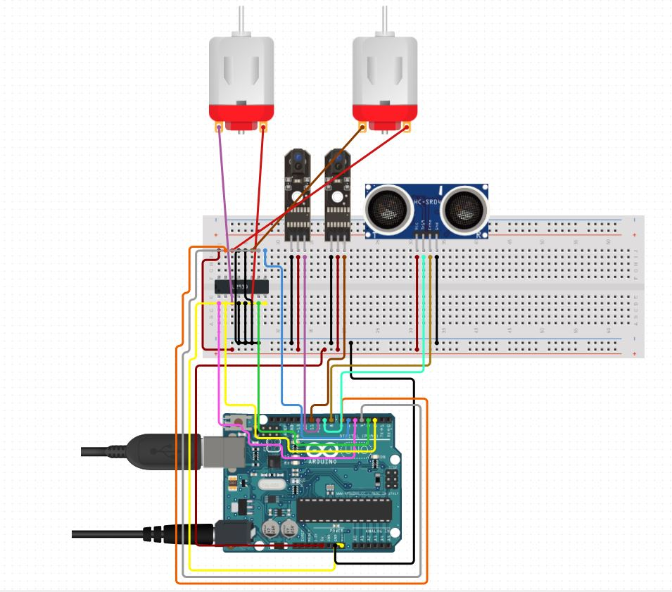

# Embedded-projects
## Line follower robot with obstacle avaoidance feature
it code is written in c++ for arduino .
This project can be a good start to practice the movement of the motors using H bridge IC. 

## Components
1) Arduino Uno (microcontroller)
2) IR sensor x2
3) Motor x2
4) Motor driver module or H bridge IC L293D
4) Ultrasonic sensor x1 

## Below mention arethe circuit diagram

 
 
 ##
 
 ## Working
 Two IR sensors are used as IR sensor emit and detect infrared radiation and as black color is aborber so it failed to reflect back infrared radiation. Two IR sensor placed in such a way that black line need to be fit in between them so detection of the black line can be detected if reciewver of the IR sensor failed to detect radiation.
 
 IC L293D is used to controller the follow of the current so that it can handle motor in bi-directional way.
 Ultrasonic also works with the phenomena if emit and detect but it emit sonic waves and distance can be measure with the time it take to reflect back to the reciever.
 d= speed of sound * time.
 
range is set 20cm of any object appear with in the range of 20cm of robot is stop untill object get away from the path.
 
 
